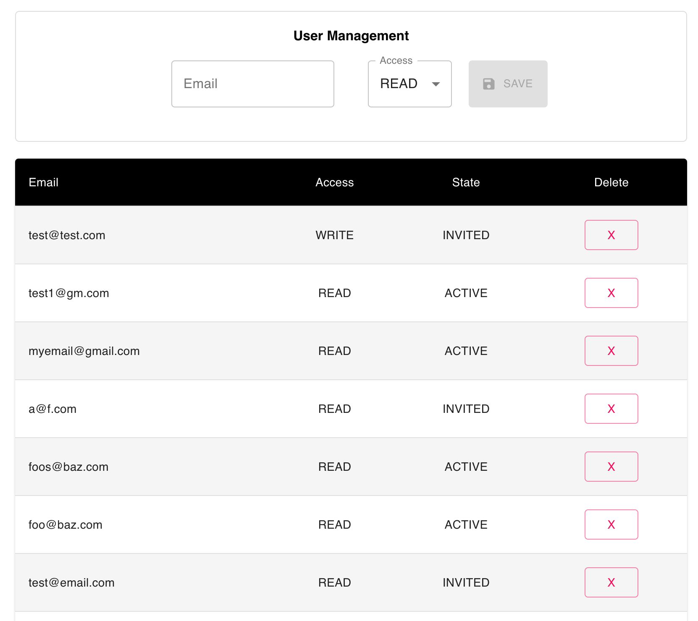

# User Management Page

For this challenge you will create a simple user management web page. 

The page allows administrators to create users, modify user access, and delete users.

You should use the same practices implementing this challenge as you would for any professional code you write. You may use any JavaScript framework or library to complete it.

Please come prepared with an empty project in the framework of your choice. You should be able to run your code locally and view an empty page in the browser. 

All other project work will be performed during the paired programming exercise on site. 

The following sections outline the different components of the web application:

## The Data Model

- Each user account has an email address and access level associated with it.
- A user account is created when an administrator invites the user to join the service.
- The account has a state that indicates whether the user has accepted the invite.
- A user account will have the following information:
  - Email address
  - Access level: “admin”, “read”, or “write”
  - status: “active”, “inactive”, "invited"

## The Backend

The provided backend will be responsible for storing user account information. It exposes the following methods:

- Create users
- Retrieve a list of users
- Change user access

When a user is created, their status is invited.

## The User Interface

The user management page lists all known users and provides ways to manipulate them. 

The user list should display the following properties for each user:

  - Email address
  - Access level: “admin”, “read”, or “write”
  - status: “active”, “inactive”
  - an action button:
    - delete user

The user management page allows the administrator to invite new users.

To invite new users, the administrator will need to provide the following:

- An email address
- An access level

